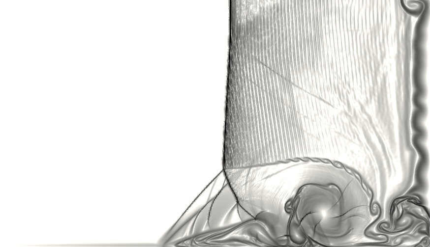

.. highlight:: none

********
Examples
********

PyFR includes several test cases to showcase the functionality of the
solver.  It is important to note, however, that these examples are all
relatively small 2D simulations and, as such, are *not* suitable for
scalability or performance studies.

Euler Equations
===============

2D Euler Vortex
---------------

Proceed with the following steps to run a parallel 2D Euler vortex
simulation on a structured mesh:

1. Create a working directory called ``euler_vortex_2d/``

2. Copy the configuration file
   ``PyFR/examples/euler_vortex_2d/euler_vortex_2d.ini`` into
   ``euler_vortex_2d/``

3. Copy the `Gmsh <http:http://geuz.org/gmsh/>`_ file
   ``PyFR/examples/euler_vortex_2d/euler_vortex_2d.msh`` into
   ``euler_vortex_2d/``

4. Run pyfr to convert the `Gmsh <http:http://geuz.org/gmsh/>`_
   mesh file into a PyFR mesh file called ``euler_vortex_2d.pyfrm``::

        pyfr import euler_vortex_2d.msh euler_vortex_2d.pyfrm

5. Run pyfr to partition the PyFR mesh file into two pieces::

        pyfr partition 2 euler_vortex_2d.pyfrm .

6. Run pyfr to solve the Euler equations on the mesh, generating a
   series of PyFR solution files called ``euler_vortex_2d*.pyfrs``::

        mpiexec -n 2 pyfr run -b cuda -p euler_vortex_2d.pyfrm euler_vortex_2d.ini

7. Run pyfr on the solution file ``euler_vortex_2d-100.0.pyfrs``
   converting it into an unstructured VTK file called
   ``euler_vortex_2d-100.0.vtu``::

        pyfr export euler_vortex_2d.pyfrm euler_vortex_2d-100.0.pyfrs euler_vortex_2d-100.0.vtu

8. Visualise the unstructured VTK file in `Paraview
   <http://www.paraview.org/>`_

.. figure:: ../fig/euler_vortex_2d/euler_vortex_2d.png
   :width: 450px
   :figwidth: 450px
   :alt: euler vortex
   :align: center

   Colour map of density distribution at 100 time units.

Compressible Navier--Stokes Equations
=====================================

2D Couette Flow
---------------

Proceed with the following steps to run a serial 2D Couette flow
simulation on a mixed unstructured mesh:

1. Create a working directory called ``couette_flow_2d/``

2. Copy the configuration file
   ``PyFR/examples/couette_flow_2d/couette_flow_2d.ini`` into
   ``couette_flow_2d/``

3. Copy the `Gmsh <http:http://geuz.org/gmsh/>`_ mesh file
   ``PyFR/examples/couette_flow_2d/couette_flow_2d.msh`` into
   ``couette_flow_2d/``

4. Run pyfr to covert the `Gmsh <http:http://geuz.org/gmsh/>`_
   mesh file into a PyFR mesh file called ``couette_flow_2d.pyfrm``::

        pyfr import couette_flow_2d.msh couette_flow_2d.pyfrm

5. Run pyfr to solve the Navier-Stokes equations on the mesh,
   generating a series of PyFR solution files called
   ``couette_flow_2d-*.pyfrs``::

        pyfr run -b cuda -p couette_flow_2d.pyfrm couette_flow_2d.ini

6. Run pyfr on the solution file ``couette_flow_2d-040.pyfrs``
   converting it into an unstructured VTK file called
   ``couette_flow_2d-040.vtu``::

        pyfr export couette_flow_2d.pyfrm couette_flow_2d-040.pyfrs couette_flow_2d-040.vtu

7. Visualise the unstructured VTK file in `Paraview
   <http://www.paraview.org/>`_

.. figure:: ../fig/couette_flow_2d/couette_flow_2d.png
   :width: 450px
   :figwidth: 450px
   :alt: couette flow
   :align: center

   Colour map of steady-state density distribution.

Incompressible Navier--Stokes Equations
=======================================

2D Incompressible Cylinder Flow
-------------------------------

Proceed with the following steps to run a serial 2D incompressible cylinder
flow simulation on a mixed unstructured mesh:

1. Create a working directory called ``inc_cylinder_2d/``

2. Copy the configuration file
   ``PyFR/examples/inc_cylinder_2d/inc_cylinder_2d.ini`` into
   ``inc_cylinder_2d/``

3. Copy the compressed `Gmsh <http:http://geuz.org/gmsh/>`_ mesh file
   ``PyFR/examples/inc_cylinder_2d/inc_cylinder_2d.msh.gz`` into
   ``inc_cylinder_2d/``

4. Unzip the file and run pyfr to covert the `Gmsh <http:http://geuz.org/gmsh/>`_
   mesh file into a PyFR mesh file called ``inc_cylinder_2d.pyfrm``::

        zcat inc_cylinder_2d.msh.gz | pyfr import -tgmsh - inc_cylinder_2d.pyfrm

5. Run pyfr to solve the incompressible Navier-Stokes equations on the mesh,
   generating a series of PyFR solution files called
   ``inc_cylinder_2d-*.pyfrs``::

        pyfr run -b cuda -p inc_cylinder_2d.pyfrm inc_cylinder_2d.ini

6. Run pyfr on the solution file ``inc_cylinder_2d-75.00.pyfrs``
   converting it into an unstructured VTK file called
   ``inc_cylinder_2d-75.00.vtu``::

        pyfr export inc_cylinder_2d.pyfrm inc_cylinder_2d-75.00.pyfrs inc_cylinder_2d-75.00.vtu

7. Visualise the unstructured VTK file in `Paraview
   <http://www.paraview.org/>`_

.. figure:: ../fig/inc_cylinder_2d/inc_cylinder_2d.png
   :width: 450px
   :figwidth: 450px
   :alt: cylinder
   :align: center

   Colour map of velocity magnitude distribution at 75 time units.

Compressible Supersonic Navier--Stokes Equations
================================================

2D Viscous Shock Tube
---------------------

Proceed with the following steps to run a serial 2D viscous shock Tube
simulation on a structured mesh:

1. Create a working directory called ``viscous_shock_tube_2d/``

2. Copy the configuration file
   ``PyFR/examples/viscous_shock_tube_2d/viscous_shock_tube_2d.ini`` into
   ``viscous_shock_tube_2d/``

3. Copy the compressed `Gmsh <http:http://geuz.org/gmsh/>`_ mesh file
   ``PyFR/examples/viscous_shock_tube_2d/viscous_shock_tube_2d.msh.gz`` into
   ``viscous_shock_tube_2d/``

4. Unzip the file and run pyfr to covert the `Gmsh <http:http://geuz.org/gmsh/>`_
   mesh file into a PyFR mesh file called ``viscous_shock_tube_2d.pyfrm``::

        zcat viscous_shock_tube_2d.msh.gz | pyfr import -tgmsh - viscous_shock_tube_2d.pyfrm

5. Run pyfr to solve the compressible Navier-Stokes equations on the mesh,
   generating a series of PyFR solution files called
   ``viscous_shock_tube_2d-*.pyfrs``::

        pyfr run -b cuda -p viscous_shock_tube_2d.pyfrm viscous_shock_tube_2d.ini

6. Run pyfr on the solution file ``viscous_shock_tube_2d-1.00.pyfrs``
   converting it into an unstructured VTK file called
   ``viscous_shock_tube_2d-1.00.vtu``::

        pyfr export viscous_shock_tube_2d.pyfrm viscous_shock_tube_2d-1.00.pyfrs viscous_shock_tube_2d-1.00.vtu

7. Visualise the unstructured VTK file in `Paraview
   <http://www.paraview.org/>`_

   Colour map of density gradient magnitude at 1 time unit.
