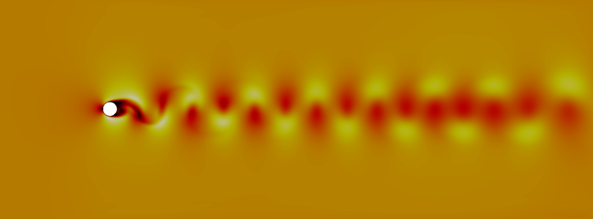
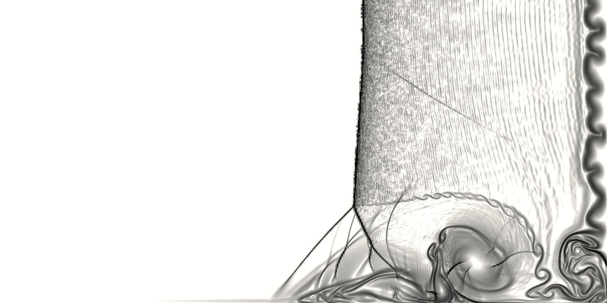
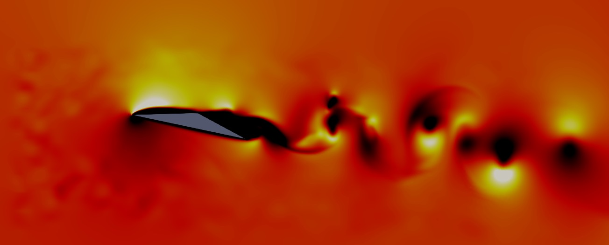
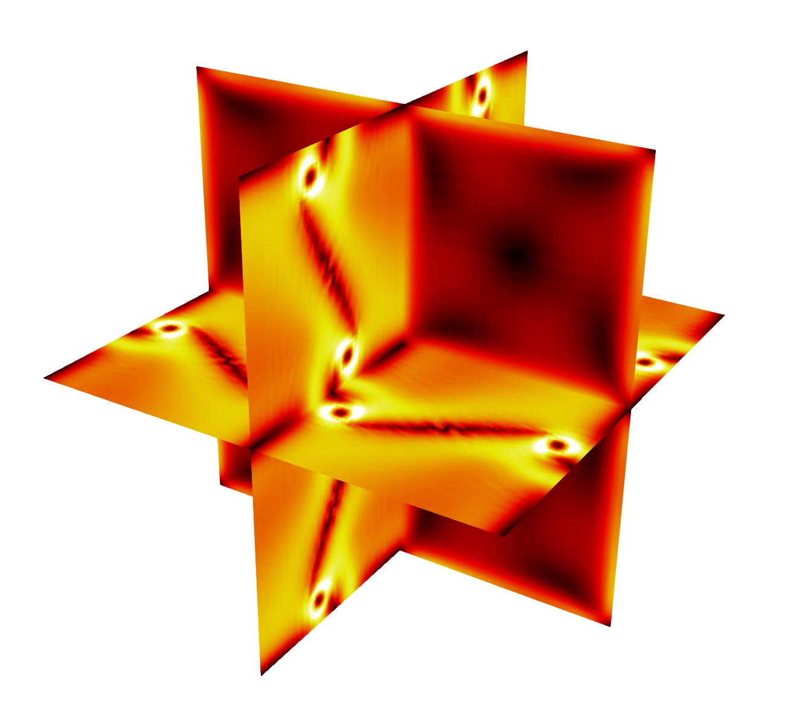

.. highlight:: none

********
Examples
********

Test cases are available in the `PyFR-Test-Cases
<https://github.com/PyFR/PyFR-Test-Cases>`_ repository. It is important
to note, however, that these examples are all relatively small 2D/3D
simulations and, as such, are *not* suitable for scalability or
performance studies.

Euler Equations
===============

2D Euler Vortex
---------------

Proceed with the following steps to run a parallel 2D Euler vortex
simulation on a structured mesh:

#. Navigate to the ``PyFR-Test-Cases/2d-euler-vortex`` directory::

        cd PyFR-Test-Cases/2d-euler-vortex

#. Run pyfr to convert the `Gmsh <http:http://geuz.org/gmsh/>`_
   mesh file into a PyFR mesh file called ``euler-vortex.pyfrm``::

        pyfr import euler-vortex.msh euler-vortex.pyfrm

#. Run pyfr to add a partitioning to the mesh::

        pyfr partition add euler-vortex.pyfrm 2

#. Run pyfr to solve the Euler equations on the mesh, generating a
   series of PyFR solution files called ``euler-vortex*.pyfrs``::

        mpiexec -n 2 pyfr -p run -b cuda euler-vortex.pyfrm euler-vortex.ini

#. Run pyfr on the solution file ``euler-vortex-100.0.pyfrs``
   converting it into an unstructured VTK file called
   ``euler-vortex-100.0.vtu``::

        pyfr export volume euler-vortex.pyfrm euler-vortex-100.0.pyfrs euler-vortex-100.0.vtu

#. Visualise the unstructured VTK file in `Paraview
   <http://www.paraview.org/>`_

.. figure:: ../fig/2d-euler-vortex/2d-euler-vortex.png
   :width: 450px
   :figwidth: 450px
   :alt: euler vortex
   :align: center

   Colour map of density distribution at 100 time units.

2D Double Mach Reflection
-------------------------

Proceed with the following steps to run a serial 2D double Mach reflection
simulation on a structured mesh:

#. Navigate to the ``PyFR-Test-Cases/2d-double-mach-reflection`` directory::

        cd PyFR-Test-Cases/2d-double-mach-reflection

#. Unzip the `Gmsh <http:http://geuz.org/gmsh/>`_
   mesh file file and run pyfr to covert it into a PyFR mesh file
   called ``double-mach-reflection.pyfrm``::

        unxz double-mach-reflection.msh.xz
        pyfr import double-mach-reflection.msh double-mach-reflection.pyfrm

#. Run pyfr to solve the compressible Euler equations on the mesh,
   generating a series of PyFR solution files called
   ``double-mach-reflection-*.pyfrs``::

        pyfr -p run -b cuda double-mach-reflection.pyfrm double-mach-reflection.ini

#. Run pyfr on the solution file ``double-mach-reflection-0.20.pyfrs``
   converting it into an unstructured VTK file called
   ``double-mach-reflection-0.20.vtu``::

        pyfr export volume double-mach-reflection.pyfrm double-mach-reflection-0.20.pyfrs double-mach-reflection-0.20.vtu

#. Visualise the unstructured VTK file in `Paraview
   <http://www.paraview.org/>`_

   Colour map of density distribution at 0.2 time units.

Navier--Stokes Equations
========================

2D Couette Flow
---------------

Proceed with the following steps to run a serial 2D Couette flow
simulation on a mixed unstructured mesh:

#. Navigate to the ``PyFR-Test-Cases/2d-couette-flow`` directory::

        cd PyFR-Test-Cases/2d-couette-flow

#. Run pyfr to covert the `Gmsh <http:http://geuz.org/gmsh/>`_
   mesh file into a PyFR mesh file called ``couette-flow.pyfrm``::

        pyfr import couette-flow.msh couette-flow.pyfrm

#. Run pyfr to solve the Navier-Stokes equations on the mesh,
   generating a series of PyFR solution files called
   ``couette-flow-*.pyfrs``::

        pyfr -p run -b cuda couette-flow.pyfrm couette-flow.ini

#. Run pyfr on the solution file ``couette-flow-040.pyfrs``
   converting it into an unstructured VTK file called
   ``couette-flow-040.vtu``::

        pyfr export volume couette-flow.pyfrm couette-flow-040.pyfrs couette-flow-040.vtu

#. Visualise the unstructured VTK file in `Paraview
   <http://www.paraview.org/>`_

   Colour map of steady-state density distribution.

2D Incompressible Cylinder Flow
-------------------------------

Proceed with the following steps to run a serial 2D incompressible cylinder
flow simulation on a mixed unstructured mesh:

#. Navigate to the ``PyFR-Test-Cases/2d-inc-cylinder`` directory::

        cd PyFR-Test-Cases/2d-inc-cylinder
        
#. Run pyfr to covert the `Gmsh <http:http://geuz.org/gmsh/>`_
   mesh file into a PyFR mesh file called ``inc-cylinder.pyfrm``::

        pyfr import inc-cylinder.msh inc-cylinder.pyfrm

#. Run pyfr to solve the incompressible Navier-Stokes equations on the mesh,
   generating a series of PyFR solution files called
   ``inc-cylinder-*.pyfrs``::

        pyfr -p run -b cuda inc-cylinder.pyfrm inc-cylinder.ini

#. Run pyfr on the solution file ``inc-cylinder-75.00.pyfrs``
   converting it into an unstructured VTK file called
   ``inc-cylinder-75.00.vtu``::

        pyfr export volume inc-cylinder.pyfrm inc-cylinder-75.00.pyfrs inc-cylinder-75.00.vtu

#. Visualise the unstructured VTK file in `Paraview
   <http://www.paraview.org/>`_

   Colour map of velocity magnitude distribution at 75 time units.

2D Viscous Shock Tube
---------------------

Proceed with the following steps to run a serial 2D viscous shock tube
simulation on a structured mesh:

#. Navigate to the ``PyFR-Test-Cases/2d-viscous-shock-tube`` directory::

        cd PyFR-Test-Cases/2d-viscous-shock-tube

#. Unzip the the `Gmsh <http:http://geuz.org/gmsh/>`_
   mesh file and run pyfr to covert it into a PyFR mesh file
   called ``viscous-shock-tube.pyfrm``::

        unxz viscous-shock-tube.msh.xz
        pyfr import viscous-shock-tube.msh viscous-shock-tube.pyfrm

#. Run pyfr to solve the compressible Navier-Stokes equations on the mesh,
   generating a series of PyFR solution files called
   ``viscous-shock-tube-*.pyfrs``::

        pyfr -p run -b cuda viscous-shock-tube.pyfrm viscous-shock-tube.ini

#. Run pyfr on the solution file ``viscous-shock-tube-1.00.pyfrs``
   converting it into an unstructured VTK file called
   ``viscous-shock-tube-1.00.vtu``::

        pyfr export volume viscous-shock-tube.pyfrm viscous-shock-tube-1.00.pyfrs viscous-shock-tube-1.00.vtu

#. Visualise the unstructured VTK file in `Paraview
   <http://www.paraview.org/>`_

   Colour map of density distribution at 1 time unit.

3D Triangular Aerofoil
----------------------

Proceed with the following steps to run a serial 3D triangular aerofoil
simulation with inflow turbulence:

#. Navigate to the ``PyFR-Test-Cases/3d-triangular-aerofoil`` directory::

        cd PyFR-Test-Cases/3d-triangular-aerofoil

#. Unzip the `Gmsh <http:http://geuz.org/gmsh/>`_
   mesh file file and run pyfr to covert it into a PyFR mesh file called
   ``triangular-aerofoil.pyfrm``::

        unxz triangular-aerofoil.msh.xz
        pyfr import triangular-aerofoil.msh triangular-aerofoil.pyfrm

#. Run pyfr to solve the Navier-Stokes equations on the mesh,
   generating a series of PyFR solution files called
   ``triangular-aerofoil-*.pyfrs``::

        pyfr -p run -b cuda triangular-aerofoil.pyfrm triangular-aerofoil.ini

#. Run pyfr on the solution file ``triangular-aerofoil-5.00.pyfrs``
   converting it into an unstructured VTK file called
   ``triangular-aerofoil-5.00.vtu``::

        pyfr export volume triangular-aerofoil.pyfrm triangular-aerofoil-5.00.pyfrs triangular-aerofoil-5.00.vtu

#. Visualise the unstructured VTK file in `Paraview
   <http://www.paraview.org/>`_

   Colour map of velocity magnitude distribution at 5 time units.

#. If you have installed :ref:`Ascent` you can run the same case with the
   :ref:`soln-plugin-ascent` plugin activated, which will produce a series
   of .png images that can then be merged into an animation using a utility
   such as ffmpeg::

        pyfr -p run -b cuda triangular-aerofoil.pyfrm triangular-aerofoil-ascent.ini

3D Taylor-Green
---------------

Proceed with the following steps to run a serial 3D Taylor-Green simulation:

#. Navigate to the ``PyFR-Test-Cases/3d-taylor-green`` directory::

        cd PyFR-Test-Cases/3d-taylor-green

#. Unzip the `Gmsh <http:http://geuz.org/gmsh/>`_
   mesh file file and run pyfr to covert it into a PyFR mesh file called
   ``taylor-green.pyfrm``::

        unxz taylor-green.msh.xz
        pyfr import taylor-green.msh taylor-green.pyfrm

#. Run pyfr to solve the Navier-Stokes equations on the mesh,
   generating a series of PyFR solution files called
   ``taylor-green-*.pyfrs``::

        pyfr -p run -b cuda taylor-green.pyfrm taylor-green.ini

#. Run pyfr on the solution file ``taylor-green-5.00.pyfrs``
   converting it into an unstructured VTK file called
   ``taylor-green-5.00.vtu``::

        pyfr export volume taylor-green.pyfrm taylor-green-5.00.pyfrs taylor-green-5.00.vtu

#. Visualise the unstructured VTK file in `Paraview
   <http://www.paraview.org/>`_

   Colour map of velocity magnitude distribution at 5 time units.

#. If you have installed :ref:`Ascent` you can run the same case with the
   :ref:`soln-plugin-ascent` plugin activated, which will produce a series
   of .png images that can then be merged into an animation using a utility
   such as ffmpeg::

        pyfr -p run -b cuda taylor-green.pyfrm taylor-green-ascent.ini
