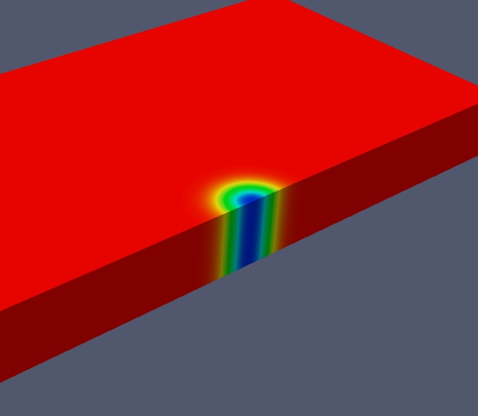
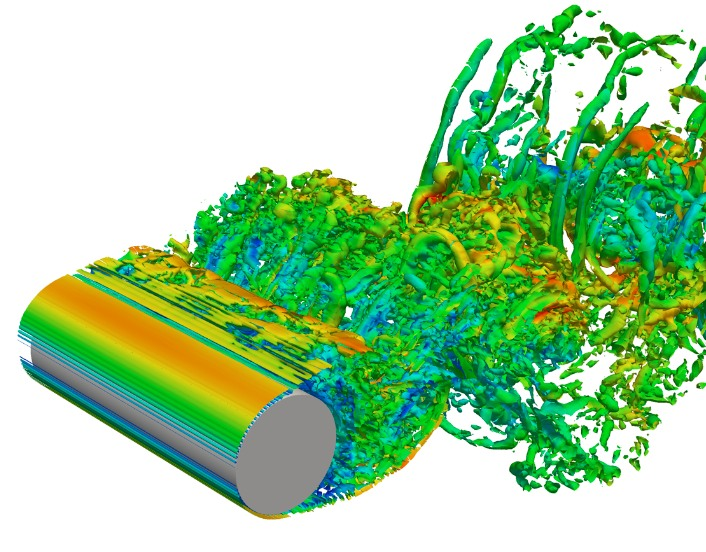

=========
Tutorials
=========

Introduction
------------

The following tutorials are designed to get you familiar with PyFR and
its range of functionality.

3D Euler Vortex
---------------

Proceed with the following steps to run a 3D Euler vortex simulation:

1. Create a working directory called ``euler_vortex/``
2. Copy the file ``PyFR/examples/euler_vortex/euler_vortex.ini`` into ``euler_vortex/``
3. Run pyfr-mesh to generate a single partition hexahedral mesh called ``euler_vortex.pyfrm``

    ``pyfr-mesh .... euler_vortex.pyfrm``

4. Run pyfr-sim to solve Euler's equations on the mesh, generating a series of solution files called ``euler_vortex_*.pyfrs``

    ``pyfr-sim .... euler_vortex.pyfrm euler_vortex.ini``

5. Run pyfr-postp to generate a series of VTK files called ``euler_vortex_*.vtu``

    ``pyfr-postp .... euler_vortex.pyfrs``

6. Visualise the VTK files in `Paraview <http://www.paraview.org/>`_

   Colour map of density.

3D Cylinder Flow
----------------

Proceed with the following steps to run a 3D cylinder flow simulation:

1. Create a working directory called ``cylinder_flow/``
2. Copy the file ``PyFR/examples/cylinder_flow/cylinder_flow.ini`` into ``cylinder_flow/``
3. Copy the file ``PyFR/examples/cylinder_flow/cylinder_flow.msh`` into ``cylinder_flow/``
4. Run pyfr-mesh to generate a four partition hexahedral mesh called ``cylinder_flow.pyfrm``

    ``pyfr-mesh .... cylinder_flow.pyfrm``

4. Run pyfr-sim to solve the compressible Navier-Stokes equations on the mesh, generating a series of solution files called ``cylinder_flow_*.pyfrs``

    ``pyfr-sim .... cylinder_flow.pyfrm cylinder_flow.ini``

5. Run pyfr-postp to generate a series of VTK files called ``cylinder_flow_*.vtu``

    ``pyfr-postp .... cylinder_flow.pyfrs``

6. Visualise the VTK files in `Paraview <http://www.paraview.org/>`_

   Iso-surfaces of Q-criterion coloured by velocity magnitude.

