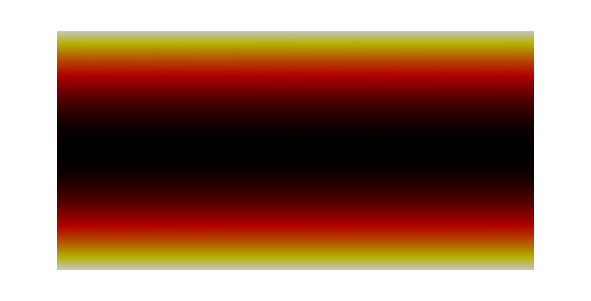

**********
User Guide
**********

Getting Started
===============

Downloading the Source
----------------------

PyFR can be obtained `here <http://www.pyfr.org/download.php>`_

Dependencies
------------

PyFR currently has a hard depndency on Python 2.7.  PyFR does not currently
support Microsoft Windows system. To run PyFR it is necessary to install the
following Python packages:

  - `mako <http://www.makotemplates.org/>`_
  - `mpi4py <http://mpi4py.scipy.org/>`_ >= 1.3
  - `numpy <http://www.numpy.org/>`_ >= 1.6
  - `sympy <http://sympy.org/>`_ >= 0.7.3

CUDA Backend
^^^^^^^^^^^^

The CUDA backend targets NVIDIA GPUs with a compute capability of 2.0 or
later.  This requires CUDA 4.2 or later to be installed and functioning
on the system along with the PyCUDA wrapper.

  - `pycuda <http://mathema.tician.de/software/pycuda/>`_ >= 2011.2

OpenMP Backend
^^^^^^^^^^^^^^

  - GCC >= 4.7
  - A BLAS library compiled as a shared library,
    e.g, `OpenBLAS <http://www.openblas.net/>`_.

Installation
------------

Before running PyFR it is first necessary to
either install PyFR using the provided ``setup.py`` installer or add the
root PyFR directory to
``PYTHONPATH``::

  user@computer ~/PyFR$ export PYTHONPATH=.:$PYTHONPATH
  user@computer ~/PyFR$ python pyfr/scripts/pyfr-sim --help

Running PyFR
============

PyFR consists of three separate programs:

1. PyFR-Mesh --- for pre-processing. This includes converting third party mesh files to the PyFR format.
2. PyFR-Sim --- for running the PyFR 2/3D compressible Euler or Navier-Stokes flow solver.
3. PyFR-PostP --- for post-processing mesh and solution files. This includes conversion of PyFR mesh and solution files for visualisation with third party software.

Once PyFR has been installed, the user-interface of each program is accessible from a terminal window. Each of these interfaces follow the same basic structure:
the program name (in lower-case writing), and one or more levels of sub-command to select the requisite function. Further positional and/or optional arguments then provide
the inputs required for that subroutine.

Help functionality is provided directly from each program in the terminal window. For example, to find out how to restart a PyFR simulation, one can enter into a terminal:

``pyfr-sim --help``

This will return the following output:

.. code-block:: none

    usage: pyfr-sim [-h] [--verbose] [--backend BACKEND] [--progress]
                [--nansweep N]
                {run,restart} ...

    Runs a PyFR simulation

    positional arguments:
        {run,restart}         sub-command help
        run                 run --help
        restart             restart --help

    optional arguments:
        -h, --help            show this help message and exit
        --verbose, -v
        --backend BACKEND, -b BACKEND Backend to use
        --progress, -p        show a progress bar
        --nansweep N, -n N    check for NaNs every N steps

Aside from detailing options available to all of PyFR-Sim, it is stated that the two available subcommands are "run" and "restart". Entering ``pyfr-sim restart --help`` details
the required syntax for restarting a PyFR simulation from an existing solution file:

.. code-block:: none

    usage: pyfr-sim restart [-h] mesh soln [cfg]

    positional arguments:
        mesh        mesh file
        soln        solution file
        cfg         new config file

    optional arguments:
        -h, --help  show this help message and exit

Note that the square brackets denote the config file as an optional argument. It is only needed if the user wishes to change the configuration from the restart.

The functionality of each program and sub-command is summarised in the following sections.

PyFR-Mesh
---------

PyFR-Mesh contains pre-processing tools for PyFR.

The convert subcommand allows the user to:

1. Convert a `Gmsh <http:http://geuz.org/gmsh/>`_ mesh file to the PyFR native format: ``pyfr-mesh convert ...``

PyFR-Sim
--------

PyFR-Sim executes the PyFR compressible Euler or Navier-Stokes flow solver.

There are two subcommands which permit the user to:

1. Start a new PyFR simulation: ``pyfr-sim run ...``
2. Restart a PyFR simulation from an existing solution file: ``pyfr-sim restart ...``

Running in Parallel
^^^^^^^^^^^^^^^^^^^
The PyFR solver can be run in parallel given a suitable system, and a mesh with the requisite number of partitions.

This is achieved by prefixing the serial ``pyfr-sim ...``
command with ``mpirun -n <cores/devices>``. For example, to run the solver on four local NVidia GPUs one should enter:

.. code-block:: none

    mpirun -n 4 pyfr-sim run mesh.pyfrm config.ini

Note that the number of cores or devices must be equal to the number of mesh partitions.

Configuration File Format (.ini)
^^^^^^^^^^^^^^^^^^^^^^^^^^^^^^^^

At present, please use the example conig.ini files as a reference (they are located in the PyFR examples directory).
Full documentation of the config file format will be posted here directly.

PyFR-PostP
----------

PyFR-PostP encompasses a set of tools used for post-processing PyFR simulations.

Each tool can be accessed by passing a second argument after ``pyfr-postp``. Broadly, these commands allow
the user to:

1. Swap between the pyfr-file and pyfr-dir format: ``pyfr-postp unpack ...``
2. Swap between the pyfr-dir and pyfr-file format: ``pyfr-postp pack ...``
3. Convert a PyFR mesh and solution file for visualisation with ParaView: ``pyfr-postp convert ...``
4. Time-average a series of pyfr solution files (useful for comparing to steady-state data): ``pyfr-postp time-avg ...``

2D Couette Flow
===============

Proceed with the following steps to run a 2D Couette Flow simulation:

1. Create a working directory called ``couette_flow/``
2. Copy the file ``PyFR/examples/couette_flow/couette_2d.ini`` into ``couette_flow/``
3. Copy the file ``PyFR/examples/couette_flow/couette_2d_mixed.msh`` into ``couette_flow/``
4. Run pyfr-mesh to covert the mixed quadrilateral-triangular mesh into PyFR-format called ``couette_flow_2d_mixed.pyfrm``

    ``pyfr-mesh convert couette_2d_mixed.msh couette_2d_mixed.pyfrm``

5. Run pyfr-sim to solve the Navier-Stokes equations on the mesh, generating a series of solution files called ``couette_2d-*.pyfrs``

    ``pyfr-sim -p run couette_2d_mixed.pyfrm couette_2d.ini``

6. Run pyfr-postp to generate a series of VTU files called ``couette_2d_mixed-*.vtu``

    ``pyfr-postp convert couette_2d_mixed.pyfrm couette_2d-*.pyfrs couette_2d_mixed-*.vtu``

7. Visualise the VTU files in `Paraview <http://www.paraview.org/>`_

   Colour map of steady-state density distribution.

3D Euler Vortex
===============

Proceed with the following steps to run a 3D Euler vortex simulation:

1. Create a working directory called ``euler_vortex/``
2. Copy the file ``PyFR/examples/euler_vortex/euler_vortex.ini`` into ``euler_vortex/``
3. Run pyfr-mesh to generate a hexahedral mesh with a single partition called ``euler_vortex.pyfrm``

    ``pyfr-mesh .... euler_vortex.pyfrm``

4. Run pyfr-sim to solve Euler's equations on the mesh, generating a series of solution files called ``euler_vortex_*.pyfrs``

    ``pyfr-sim -p run euler_vortex.pyfrm euler_vortex.ini``

5. Run pyfr-postp to generate a series of VTK files called ``euler_vortex_*.vtu``

    ``pyfr-postp .... euler_vortex.pyfrs``

6. Visualise the VTK files in `Paraview <http://www.paraview.org/>`_

.. figure:: ../fig/euler_vortex/euler_vortex.jpg
   :width: 450px
   :figwidth: 450px
   :alt: cylinder flow
   :align: center

   Colour map of density.

3D Cylinder Flow
================

Proceed with the following steps to run a 3D cylinder flow simulation:

1. Create a working directory called ``cylinder_flow/``
2. Copy the file ``PyFR/examples/cylinder_flow/cylinder_flow.ini`` into ``cylinder_flow/``
3. Copy the file ``PyFR/examples/cylinder_flow/cylinder_flow.msh`` into ``cylinder_flow/``
4. Run pyfr-mesh to generate a four partition hexahedral mesh called ``cylinder_flow.pyfrm``

    ``pyfr-mesh .... cylinder_flow.pyfrm``

4. Run pyfr-sim on four nodes to solve the compressible Navier-Stokes equations on the mesh, generating a series of solution files called ``cylinder_flow_*.pyfrs``

    ``mpirun -n 4 pyfr-sim -p run cylinder_flow.pyfrm cylinder_flow.ini``

5. Run pyfr-postp to generate a series of VTK files called ``cylinder_flow_*.vtu``

    ``pyfr-postp .... cylinder_flow.pyfrs``

6. Visualise the VTK files in `Paraview <http://www.paraview.org/>`_

.. figure:: ../fig/cylinder_flow/cylinder_flow.jpg
   :width: 450px
   :figwidth: 450px
   :alt: cylinder flow
   :align: center

   Iso-surfaces of Q-criterion coloured by velocity magnitude.
