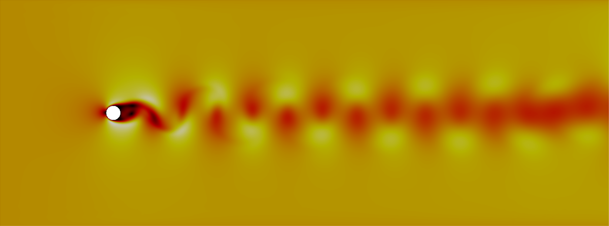

.. highlightlang:: none

**********
User Guide
**********

Getting Started
===============

Downloading the Source
----------------------

PyFR can be obtained `here <http://www.pyfr.org/download.php>`_.

Dependencies
------------

Overview
^^^^^^^^

PyFR |release| has a hard dependency on Python 3.5+ and the following
Python packages:

1. `appdirs <https://github.com/ActiveState/appdirs>`_ >= 1.4.0
2. `gimmik <https://github.com/vincentlab/GiMMiK>`_ >= 2.0
3. `h5py <http://www.h5py.org/>`_ >= 2.6
4. `mako <http://www.makotemplates.org/>`_ >= 1.0.0
5. `mpi4py <http://mpi4py.scipy.org/>`_ >= 2.0
6. `numpy <http://www.numpy.org/>`_ >= 1.8
7. `pytools <https://pypi.python.org/pypi/pytools>`_ >= 2016.2.1

Note that due to a bug in `numpy <http://www.numpy.org/>`_ PyFR is not
compatible with 32-bit Python distributions.

CUDA Backend
^^^^^^^^^^^^

The CUDA backend targets NVIDIA GPUs with a compute capability of 2.0
or greater. The backend requires:

1. `CUDA <https://developer.nvidia.com/cuda-downloads>`_ >= 4.2
2. `pycuda <http://mathema.tician.de/software/pycuda/>`_ >= 2015.1

OpenCL Backend
^^^^^^^^^^^^^^

The OpenCL backend targets a range of accelerators including GPUs from
AMD and NVIDIA. The backend requires:

1. OpenCL
2. `pyopencl <http://mathema.tician.de/software/pyopencl/>`_
   >= 2015.2.4
3. `CLBlast <https://github.com/CNugteren/CLBlast>`_

OpenMP Backend
^^^^^^^^^^^^^^

The OpenMP backend targets multi-core CPUs. The backend requires:

1. GCC >= 4.9
2. A BLAS library compiled as a shared library
   (e.g. `OpenBLAS <http://www.openblas.net/>`_)
3. Optionally `libxsmm <https://github.com/hfp/libxsmm>`_ >= 1.6
   compiled as a shared library (STATIC=0) with BLAS=0

Running in Parallel
^^^^^^^^^^^^^^^^^^^

To partition meshes for running in parallel it is also necessary to
have one of the following partitioners installed:

1. `metis <http://glaros.dtc.umn.edu/gkhome/views/metis>`_ >= 5.0
2. `scotch <http://www.labri.fr/perso/pelegrin/scotch/>`_ >= 6.0

Importing CGNS Meshes
^^^^^^^^^^^^^^^^^^^^^

To import CGNS meshes it is necessary to have the following installed:

1. `CGNS <http://cgns.github.io/>`_ >= 3.4

Installation
------------

Overview
^^^^^^^^

PyFR |release| can be installed using `pip <https://pypi.python.org/pypi/pip>`_
and `virtualenv <https://pypi.python.org/pypi/virtualenv>`_, as shown in the
quick-start guides below.

Alternatively, PyFR |release| can be installed from
`source <http://www.pyfr.org/download.php>`_. To install the software from
source, use the provided ``setup.py`` installer or add the root PyFR directory
to ``PYTHONPATH`` using::

    user@computer ~/PyFR$ export PYTHONPATH=.:$PYTHONPATH

When installing from source, we strongly recommend using
`pip <https://pypi.python.org/pypi/pip>`_ and
`virtualenv <https://pypi.python.org/pypi/virtualenv>`_ to manage the Python
dependencies.

Quick-start macOS
^^^^^^^^^^^^^^^^^

We recommend using the package manager `homebrew <https://brew.sh/>`_.
Open the terminal and install the dependencies with the following commands::

    brew install python3 open-mpi metis
    pip3 install virtualenv

For visualisation of results, either install Paraview from the command line::

    brew cask install paraview

or dowload the app from the Paraview `website <https://www.paraview.org/>`_.
Then create a virtual environment and activate it::

    virtualenv --python=python3 ENV3
    source ENV3/bin/activate

Finally install PyFR with `pip <https://pypi.python.org/pypi/pip>`_ in the
virtual environment::

    pip install pyfr

This concludes the installation. In order to run PyFR with the OpenMP backend
(see `Running PyFR`_), use the following settings in the configuration file
(``.ini``)::

    [backend-openmp]
    cc = gcc-8
    cblas = /usr/lib/libblas.dylib
    cblas-type = parallel

Note the version of the compiler which must support the ``openmp`` flag.
This has been tested on macOS 10.14.

Quick-start Ubuntu
^^^^^^^^^^^^^^^^^^

Open the terminal and install the dependencies with the following commands::

    sudo apt install python3 python3-pip libopenmpi-dev openmpi-bin
    sudo apt install metis libmetis-dev libblas3
    pip3 install virtualenv

For visualisation of results, either install Paraview from the command line::

    sudo apt install paraview

or dowload the app from the Paraview `website <https://www.paraview.org/>`_.
Then create a virtual environment and activate it::

    python3 -m virtualenv ENV3
    source ENV3/bin/activate

Finally install PyFR with `pip <https://pypi.python.org/pypi/pip>`_ in the
virtual environment::

    pip install pyfr

This concludes the installation. In order to run PyFR with the OpenMP backend
(see `Running PyFR`_), use the following settings in the configuration file
(``.ini``)::

    [backend-openmp]
    cc = gcc
    cblas = /usr/lib/x86_64-linux-gnu/blas/libblas.so.3
    cblas-type = parallel

This has been tested on Ubuntu 18.04.

Running PyFR
============

Overview
--------

PyFR |release| uses three distinct file formats:

1. ``.ini`` --- configuration file
2. ``.pyfrm`` --- mesh file
3. ``.pyfrs`` --- solution file

The following commands are available from the ``pyfr`` program:

1. ``pyfr import`` --- convert a `Gmsh
   <http:http://geuz.org/gmsh/>`_ .msh file or `CGNS
   <http://cgns.github.io/>`_ .cgns file into a PyFR .pyfrm file.

   Example::

        pyfr import mesh.msh mesh.pyfrm

2. ``pyfr partition`` --- partition an existing mesh and
   associated solution files.

   Example::

       pyfr partition 2 mesh.pyfrm solution.pyfrs .

3. ``pyfr run`` --- start a new PyFR simulation. Example::

        pyfr run mesh.pyfrm configuration.ini

4. ``pyfr restart`` --- restart a PyFR simulation from an existing
   solution file. Example::

        pyfr restart mesh.pyfrm solution.pyfrs

5. ``pyfr export`` --- convert a PyFR .pyfrs file into an
   unstructured VTK .vtu or .pvtu file. Example::

        pyfr export mesh.pyfrm solution.pyfrs solution.vtu

Running in Parallel
^^^^^^^^^^^^^^^^^^^

``pyfr`` can be run in parallel. To do so prefix ``pyfr`` with
``mpiexec -n <cores/devices>``. Note that the mesh must be
pre-partitioned, and the number of cores or devices must be equal to
the number of partitions.

Configuration File (.ini)
-------------------------

Overview
^^^^^^^^

The .ini configuration file parameterises the simulation. It is written
in the `INI <http://en.wikipedia.org/wiki/INI_file>`_ format.
Parameters are grouped into sections. The roles of each section and
their associated parameters are described below.

[backend]
^^^^^^^^^

Parameterises the backend with

1. ``precision`` --- number precision:

    ``single`` | ``double``

2. ``rank-allocator`` --- MPI rank allocator:

    ``linear`` | ``random``

Example::

    [backend]
    precision = double
    rank-allocator = linear

[backend-cuda]
^^^^^^^^^^^^^^

Parameterises the CUDA backend with

1. ``device-id`` --- method for selecting which device(s) to run on:

     *int* | ``round-robin`` | ``local-rank``

2. ``gimmik-max-nnz`` --- cutoff for GiMMiK in terms of the number of
   non-zero entires in a constant matrix:

     *int*

3. ``mpi-type`` --- type of MPI library that is being used:

     ``standard`` | ``cuda-aware``

4. ``block-1d`` --- block size for one dimensional pointwise kernels:

     *int*

5. ``block-2d`` --- block size for two dimensional pointwise kernels:

    *int*, *int*

Example::

    [backend-cuda]
    device-id = round-robin
    gimmik-max-nnz = 512
    mpi-type = standard
    block-1d = 64
    block-2d = 128, 2

[backend-opencl]
^^^^^^^^^^^^^^^^

Parameterises the OpenCL backend with

1. ``platform-id`` --- for selecting platform id:

    *int* | *string*

2. ``device-type`` --- for selecting what type of device(s) to run on:

    ``all`` | ``cpu`` | ``gpu`` | ``accelerator``

3. ``device-id`` --- for selecting which device(s) to run on:

    *int* | *string* | ``local-rank``

4. ``gimmik-max-nnz`` --- cutoff for GiMMiK in terms of the number of
   non-zero entires in a constant matrix:

     *int*

5. ``local-size-1d`` --- local work size for one dimensional pointwise
   kernels:

    *int*

6. ``local-size-2d`` --- local work size for two dimensional pointwise
   kernels:

    *int*, *int*

Example::

    [backend-opencl]
    platform-id = 0
    device-type = gpu
    device-id = local-rank
    gimmik-max-nnz = 512
    local-size-1d = 16
    local-size-2d = 128, 1

[backend-openmp]
^^^^^^^^^^^^^^^^

Parameterises the OpenMP backend with

1. ``cc`` --- C compiler:

    *string*

2. ``cflags`` --- additional C compiler flags:

    *string*

3. ``alignb`` --- alignment requirement in bytes; must be a power of
   two and at least 32:

    *int*

4. ``cblas`` --- path to shared C BLAS library:

    *string*

5. ``cblas-type`` --- type of BLAS library:

    ``serial`` | ``parallel``

6. ``gimmik-max-nnz`` --- cutoff for GiMMiK in terms of the number of
   non-zero entires in a constant matrix:

    *int*

7. ``libxsmm-block-sz`` --- blocking factor to use for libxsmm; must
   be a multiple of 16:

    *int*

8. ``libxsmm-max-sz`` --- cutoff for libxsmm in terms of the number of
   entires in a constant matrix:

    *int*

Example::

    [backend-openmp]
    cc = gcc
    cblas= example/path/libBLAS.dylib
    cblas-type = parallel

[constants]
^^^^^^^^^^^

Sets constants used in the simulation

1. ``gamma`` --- ratio of specific heats for ``euler`` |
   ``navier-stokes``:

    *float*

2. ``mu`` --- dynamic viscosity for ``navier-stokes``:

    *float*

3. ``nu`` --- kinematic viscosity for ``ac-navier-stokes``:

    *float*

4. ``Pr`` --- Prandtl number for ``navier-stokes``:

    *float*

5. ``cpTref`` --- product of specific heat at constant pressure and
   reference temperature for ``navier-stokes`` with Sutherland's Law:

   *float*

6. ``cpTs`` --- product of specific heat at constant pressure and
   Sutherland temperature for ``navier-stokes`` with Sutherland's Law:

   *float*

7. ``ac-zeta`` --- artificial compressibility factor for ``ac-euler`` |
   ``ac-navier-stokes``

   *float*

Example::

    [constants]
    gamma = 1.4
    mu = 0.001
    Pr = 0.72

[solver]
^^^^^^^^

Parameterises the solver with

1. ``system`` --- governing system:

    ``euler`` | ``navier-stokes`` | ``ac-euler`` | ``ac-navier-stokes``

    where

    ``navier-stokes`` requires

        - ``viscosity-correction`` --- viscosity correction:

          ``none`` | ``sutherland``

        - ``shock-capturing`` --- shock capturing scheme:

          ``none`` | ``artificial-viscosity``

2. ``order`` --- order of polynomial solution basis:

    *int*

3. ``anti-alias`` --- type of anti-aliasing:

    ``flux`` | ``surf-flux`` | ``div-flux`` | ``flux, surf-flux`` |
    ``flux, div-flux`` | ``surf-flux, div-flux`` |
    ``flux, surf-flux, div-flux``

Example::

    [solver]
    system = navier-stokes
    order = 3
    anti-alias = flux
    viscosity-correction = none
    shock-capturing = artificial-viscosity

[solver-time-integrator]
^^^^^^^^^^^^^^^^^^^^^^^^

Parameterises the time-integration scheme used by the solver with

1. ``formulation`` --- formulation:

    ``std`` | ``dual``

    where

    ``std`` requires

        - ``scheme`` --- time-integration scheme

           ``euler`` | ``rk34`` | ``rk4`` | ``rk45`` | ``tvd-rk3``

        - ``tstart`` --- initial time

           *float*

        - ``tend`` --- final time

           *float*

        - ``dt`` --- time-step

           *float*

        - ``controller`` --- time-step controller

           ``none`` | ``pi``

           where

           ``pi`` only works with ``rk34`` and ``rk45`` and requires

            - ``atol`` --- absolute error tolerance

               *float*

            - ``rtol`` --- relative error tolerance

               *float*

            - ``errest-norm`` --- norm to use for estimating the error

               ``uniform`` | ``l2``

            - ``safety-fact`` --- safety factor for step size adjustment
              (suitable range 0.80-0.95)

               *float*

            - ``min-fact`` --- minimum factor by which the time-step can
              change between iterations (suitable range 0.1-0.5)

               *float*

            - ``max-fact`` --- maximum factor by which the time-step can
              change between iterations (suitable range 2.0-6.0)

               *float*

            - ``dt-max`` --- maximum permissible time-step

               *float*

    ``dual`` requires

        - ``scheme`` --- time-integration scheme

           ``backward-euler`` | ``bdf2`` | ``bdf3``

        - ``pseudo-scheme`` --- pseudo time-integration scheme

           ``euler`` | ``rk34`` | ``rk4`` | ``rk45`` | ``tvd-rk3`` | ``vermeire``

        - ``tstart`` --- initial time

           *float*

        - ``tend`` --- final time

           *float*

        - ``dt`` --- time-step

           *float*

        - ``pseudo-dt`` --- pseudo time-step

           *float*

        - ``controller`` --- pseudo time-step controller

           ``none``

        - ``pseudo-niters-max`` --- minimum number of iterations

           *int*

        - ``pseudo-niters-min`` --- maximum number of iterations

           *int*

        - ``pseudo-resid-tol`` --- pseudo residual tolerance

           *float*

        - ``pseudo-resid-norm`` --- pseudo residual norm

           ``uniform`` | ``l2``

        - ``pseudo-controller`` --- pseudo time-step controller

           ``none`` | ``local-pi``

           where

           ``local-pi`` only works with ``rk34`` and ``rk45`` and
           requires

            - ``atol`` --- absolute error tolerance

               *float*

            - ``safety-fact`` --- safety factor for pseudo time-step
              size adjustment (suitable range 0.80-0.95)

               *float*

            - ``min-fact`` --- minimum factor by which the local
              pseudo time-step can change between iterations
              (suitable range 0.98-0.998)

               *float*

            - ``max-fact`` --- maximum factor by which the local
              pseudo time-step can change between iterations
              (suitable range 1.001-1.01)

               *float*

            - ``pseudo-dt-max-mult`` --- maximum permissible
              local pseudo time-step given as a
              multiplier of ``pseudo-dt`` (suitable range 2.0-5.0)

               *float*

Example::

    [solver-time-integrator]
    formulation = std
    scheme = rk45
    controller = pi
    tstart = 0.0
    tend = 10.0
    dt = 0.001
    atol = 0.00001
    rtol = 0.00001
    errest-norm = l2
    safety-fact = 0.9
    min-fact = 0.3
    max-fact = 2.5

[solver-dual-time-integrator-multip]
^^^^^^^^^^^^^^^^^^^^^^^^^^^^^^^^^^^^

Parameterises multi-p for dual time-stepping with

1. ``pseudo-dt-fact`` --- factor by which the pseudo time-step size
   changes between multi-p levels:

    *float*

2. ``cycle`` --- nature of a single multi-p cycle:

    ``[(order,nsteps), (order,nsteps), ... (order,nsteps)]``

    where ``order`` in the first and last bracketed pair must be the
    overall polynomial order used for the simulation, and ``order`` can
    only change by one between subsequent bracketed pairs

Example::

    [solver-dual-time-integrator-multip]
    pseudo-dt-fact = 2.3
    cycle = [(3, 1), (2, 1), (1, 1), (0, 2), (1, 1), (2, 1), (3, 3)]

[solver-interfaces]
^^^^^^^^^^^^^^^^^^^

Parameterises the interfaces with

1. ``riemann-solver`` --- type of Riemann solver:

    ``rusanov`` | ``hll`` | ``hllc`` | ``roe`` | ``roem``

    where

    ``hll`` | ``hllc`` | ``roe`` | ``roem`` do not work with
    ``ac-euler`` | ``ac-navier-stokes``

2. ``ldg-beta`` --- beta parameter used for LDG:

    *float*

3. ``ldg-tau`` --- tau parameter used for LDG:

    *float*

Example::

    [solver-interfaces]
    riemann-solver = rusanov
    ldg-beta = 0.5
    ldg-tau = 0.1

[solver-interfaces-line{-mg-p\ *order*}]
^^^^^^^^^^^^^^^^^^^^^^^^^^^^^^^^^^^^^^^^

Parameterises the line interfaces, or if -mg-p\ *order* is suffixed the
line interfaces at multi-p level *order*, with

1. ``flux-pts`` --- location of the flux points on a line interface:

    ``gauss-legendre`` | ``gauss-legendre-lobatto``

2. ``quad-deg`` --- degree of quadrature rule for anti-aliasing on a
   line interface:

    *int*

3. ``quad-pts`` --- name of quadrature rule for anti-aliasing on a
   line interface:

    ``gauss-legendre`` | ``gauss-legendre-lobatto``

Example::

    [solver-interfaces-line]
    flux-pts = gauss-legendre
    quad-deg = 10
    quad-pts = gauss-legendre

[solver-interfaces-tri{-mg-p\ *order*}]
^^^^^^^^^^^^^^^^^^^^^^^^^^^^^^^^^^^^^^^

Parameterises the triangular interfaces, or if -mg-p\ *order* is
suffixed the triangular interfaces at multi-p level *order*, with

1. ``flux-pts`` --- location of the flux points on a triangular
   interface:

    ``williams-shunn``

2. ``quad-deg`` --- degree of quadrature rule for anti-aliasing on a
   triangular interface:

    *int*

3. ``quad-pts`` --- name of quadrature rule for anti-aliasing on a
   triangular interface:

    ``williams-shunn`` | ``witherden-vincent``

Example::

    [solver-interfaces-tri]
    flux-pts = williams-shunn
    quad-deg = 10
    quad-pts = williams-shunn

[solver-interfaces-quad{-mg-p\ *order*}]
^^^^^^^^^^^^^^^^^^^^^^^^^^^^^^^^^^^^^^^^

Parameterises the quadrilateral interfaces, or if -mg-p\ *order* is
suffixed the quadrilateral interfaces at multi-p level *order*, with

1. ``flux-pts`` --- location of the flux points on a quadrilateral
   interface:

    ``gauss-legendre`` | ``gauss-legendre-lobatto``

2. ``quad-deg`` --- degree of quadrature rule for anti-aliasing on a
   quadrilateral interface:

    *int*

3. ``quad-pts`` --- name of quadrature rule for anti-aliasing on a
   quadrilateral interface:

    ``gauss-legendre`` | ``gauss-legendre-lobatto`` |
    ``witherden-vincent``

Example::

    [solver-interfaces-quad]
    flux-pts = gauss-legendre
    quad-deg = 10
    quad-pts = gauss-legendre

[solver-elements-tri{-mg-p\ *order*}]
^^^^^^^^^^^^^^^^^^^^^^^^^^^^^^^^^^^^^

Parameterises the triangular elements, or if -mg-p\ *order* is suffixed
the triangular elements at multi-p level *order*, with

1. ``soln-pts`` --- location of the solution points in a triangular
   element:

    ``williams-shunn``

2. ``quad-deg`` --- degree of quadrature rule for anti-aliasing in a
   triangular element:

    *int*

3. ``quad-pts`` --- name of quadrature rule for anti-aliasing in a
   triangular element:

    ``williams-shunn`` | ``witherden-vincent``

Example::

    [solver-elements-tri]
    soln-pts = williams-shunn
    quad-deg = 10
    quad-pts = williams-shunn

[solver-elements-quad{-mg-p\ *order*}]
^^^^^^^^^^^^^^^^^^^^^^^^^^^^^^^^^^^^^^

Parameterises the quadrilateral elements, or if -mg-p\ *order* is
suffixed the quadrilateral elements at multi-p level *order*, with

1. ``soln-pts`` --- location of the solution points in a quadrilateral
   element:

    ``gauss-legendre`` | ``gauss-legendre-lobatto``

2. ``quad-deg`` --- degree of quadrature rule for anti-aliasing in a
   quadrilateral element:

    *int*

3. ``quad-pts`` --- name of quadrature rule for anti-aliasing in a
   quadrilateral element:

    ``gauss-legendre`` | ``gauss-legendre-lobatto`` |
    ``witherden-vincent``

Example::

    [solver-elements-quad]
    soln-pts = gauss-legendre
    quad-deg = 10
    quad-pts = gauss-legendre

[solver-elements-hex{-mg-p\ *order*}]
^^^^^^^^^^^^^^^^^^^^^^^^^^^^^^^^^^^^^

Parameterises the hexahedral elements, or if -mg-p\ *order* is suffixed
the hexahedral elements at multi-p level *order*, with

1. ``soln-pts`` --- location of the solution points in a hexahedral
   element:

    ``gauss-legendre`` | ``gauss-legendre-lobatto``

2. ``quad-deg`` --- degree of quadrature rule for anti-aliasing in a
   hexahedral element:

    *int*

3. ``quad-pts`` --- name of quadrature rule for anti-aliasing in a
   hexahedral element:

    ``gauss-legendre`` | ``gauss-legendre-lobatto`` |
    ``witherden-vincent``

Example::

    [solver-elements-hex]
    soln-pts = gauss-legendre
    quad-deg = 10
    quad-pts = gauss-legendre

[solver-elements-tet{-mg-p\ *order*}]
^^^^^^^^^^^^^^^^^^^^^^^^^^^^^^^^^^^^^

Parameterises the tetrahedral elements, or if -mg-p\ *order* is suffixed
the tetrahedral elements at multi-p level *order*, with

1. ``soln-pts`` --- location of the solution points in a tetrahedral
   element:

    ``shunn-ham``

2. ``quad-deg`` --- degree of quadrature rule for anti-aliasing in a
   tetrahedral element:

    *int*

3. ``quad-pts`` --- name of quadrature rule for anti-aliasing in a
   tetrahedral element:

    ``shunn-ham`` | ``witherden-vincent``

Example::

    [solver-elements-tet]
    soln-pts = shunn-ham
    quad-deg = 10
    quad-pts = shunn-ham

[solver-elements-pri{-mg-p\ *order*}]
^^^^^^^^^^^^^^^^^^^^^^^^^^^^^^^^^^^^^

Parameterises the prismatic elements, or if -mg-p\ *order* is suffixed
the prismatic elements at multi-p level *order*, with

1. ``soln-pts`` --- location of the solution points in a prismatic
   element:

    ``williams-shunn~gauss-legendre`` |
    ``williams-shunn~gauss-legendre-lobatto``

2. ``quad-deg`` --- degree of quadrature rule for anti-aliasing in a
   prismatic element:

    *int*

3. ``quad-pts`` --- name of quadrature rule for anti-aliasing in a
   prismatic element:

    ``williams-shunn~gauss-legendre`` |
    ``williams-shunn~gauss-legendre-lobatto`` | ``witherden-vincent``

Example::

    [solver-elements-pri]
    soln-pts = williams-shunn~gauss-legendre
    quad-deg = 10
    quad-pts = williams-shunn~gauss-legendre

[solver-elements-pyr{-mg-p\ *order*}]
^^^^^^^^^^^^^^^^^^^^^^^^^^^^^^^^^^^^^

Parameterises the pyramidal elements, or if -mg-p\ *order* is suffixed
the pyramidal elements at multi-p level *order*, with

1. ``soln-pts`` --- location of the solution points in a pyramidal
   element:

    ``gauss-legendre`` | ``gauss-legendre-lobatto``

2. ``quad-deg`` --- degree of quadrature rule for anti-aliasing in a
   pyramidal element:

    *int*

3. ``quad-pts`` --- name of quadrature rule for anti-aliasing in a
   pyramidal element:

    ``witherden-vincent``

Example::

    [solver-elements-pyr]
    soln-pts = gauss-legendre
    quad-deg = 10
    quad-pts = witherden-vincent

[solver-source-terms]
^^^^^^^^^^^^^^^^^^^^^

Parameterises solution, space (x, y, [z]), and time (t) dependent
source terms with

1. ``rho`` --- density source term for ``euler`` | ``navier-stokes``:

    *string*

2. ``rhou`` --- x-momentum source term for ``euler`` | ``navier-stokes``
   :

    *string*

3. ``rhov`` --- y-momentum source term for ``euler`` | ``navier-stokes``
   :

    *string*

4. ``rhow`` --- z-momentum source term for ``euler`` | ``navier-stokes``
   :

    *string*

5. ``E`` --- energy source term for ``euler`` | ``navier-stokes``
   :

    *string*

6. ``p`` --- pressure source term for ``ac-euler`` |
   ``ac-navier-stokes``:

    *string*

7. ``u`` --- x-velocity source term for ``ac-euler`` |
   ``ac-navier-stokes``:

    *string*

8. ``v`` --- y-velocity source term for ``ac-euler`` |
   ``ac-navier-stokes``:

    *string*

9. ``w`` --- w-velocity source term for ``ac-euler`` |
   ``ac-navier-stokes``:

    *string*

Example::

    [solver-source-terms]
    rho = t
    rhou = x*y*sin(y)
    rhov = z*rho
    rhow = 1.0
    E = 1.0/(1.0+x)

[solver-artificial-viscosity]
^^^^^^^^^^^^^^^^^^^^^^^^^^^^^

Parameterises artificial viscosity for shock capturing with

1. ``max-artvisc`` --- maximum artificial viscosity:

    *float*

2. ``s0`` --- sensor cut-off:

    *float*

3. ``kappa`` --- sensor range:

    *float*

Example::

    [solver-artificial-viscosity]
    max-artvisc = 0.01
    s0 = 0.01
    kappa = 5.0

[soln-filter]
^^^^^^^^^^^^^

Parameterises an exponential solution filter with

1. ``nsteps`` --- apply filter every ``nsteps``:

    *int*

2. ``alpha`` --- strength of filter:

    *float*

3. ``order`` --- order of filter:

    *int*

4. ``cutoff`` --- cutoff frequency below which no filtering is applied:

    *int*

Example::

    [soln-filter]
    nsteps = 10
    alpha = 36.0
    order = 16
    cutoff = 1

[soln-plugin-writer]
^^^^^^^^^^^^^^^^^^^^
Periodically write the solution to disk in the pyfrs format.
Parameterised with

1. ``dt-out`` --- write to disk every ``dt-out`` time units:

    *float*

2. ``basedir`` --- relative path to directory where outputs will be
   written:

    *string*

3. ``basename`` --- pattern of output names:

    *string*

4. ``post-action`` --- command to execute after writing the file:

    *string*

5. ``post-action-mode`` --- how the post-action command should be
   executed:

    ``blocking`` | ``non-blocking``

Example::

    [soln-plugin-writer]
    dt-out = 0.01
    basedir = .
    basename = files-{t:.2f}
    post-action = echo "Wrote file {soln} at time {t} for mesh {mesh}."
    post-action-mode = blocking

[soln-plugin-fluidforce-*name*]
^^^^^^^^^^^^^^^^^^^^^^^^^^^^^^^

Periodically integrates the pressure and viscous stress on the boundary
labelled ``name`` and writes out the resulting force vectors to a CSV
file. Parameterised with

1. ``nsteps`` --- integrate every ``nsteps``:

    *int*

2. ``file`` --- output file path; should the file already exist it
   will be appended to:

    *string*

3. ``header`` --- if to output a header row or not:

    *boolean*

Example::

    [soln-plugin-fluidforce-wing]
    nsteps = 10
    file = wing-forces.csv
    header = true

[soln-plugin-nancheck]
^^^^^^^^^^^^^^^^^^^^^^

Periodically checks the solution for NaN values. Parameterised with

1. ``nsteps`` --- check every ``nsteps``:

    *int*

Example::

    [soln-plugin-nancheck]
    nsteps = 10

[soln-plugin-residual]
^^^^^^^^^^^^^^^^^^^^^^

Periodically calculates the residual and writes it out to a CSV file.
Parameterised with

1. ``nsteps`` --- calculate every ``nsteps``:

    *int*

2. ``file`` --- output file path; should the file already exist it
   will be appended to:

    *string*

3. ``header`` --- if to output a header row or not:

    *boolean*

Example::

    [soln-plugin-residual]
    nsteps = 10
    file = residual.csv
    header = true

[soln-plugin-dtstats]
^^^^^^^^^^^^^^^^^^^^^^

Write time-step statistics out to a CSV file. Parameterised with

1. ``flushsteps`` --- flush to disk every ``flushsteps``:

    *int*

2. ``file`` --- output file path; should the file already exist it
   will be appended to:

    *string*

3. ``header`` --- if to output a header row or not:

    *boolean*

Example::

    [soln-plugin-dtstats]
    flushsteps = 100
    file = dtstats.csv
    header = true

[soln-plugin-pseudostats]
^^^^^^^^^^^^^^^^^^^^^^^^^

Write pseudo-step convergence history out to a CSV file. Parameterised
with

1. ``flushsteps`` --- flush to disk every ``flushsteps``:

    *int*

2. ``file`` --- output file path; should the file already exist it
   will be appended to:

    *string*

3. ``header`` --- if to output a header row or not:

    *boolean*

Example::

    [soln-plugin-pseudostats]
    flushsteps = 100
    file = pseudostats.csv
    header = true

[soln-plugin-sampler]
^^^^^^^^^^^^^^^^^^^^^

Periodically samples specific points in the volume and writes them out
to a CSV file.  The plugin actually samples the solution point
closest to each sample point, hence a slight discrepancy in the output
sampling locations is to be expected.  A nearest-neighbour search is
used to locate the closest solution point to the sample point.  The
location process automatically takes advantage of
`scipy.spatial.cKDTree <http://docs.scipy.org/doc/scipy/reference/generated/scipy.spatial.cKDTree.html>`_
where available.  Parameterised with

1. ``nsteps`` --- sample every ``nsteps``:

    *int*

2. ``samp-pts`` --- list of points to sample:

    ``[(x, y), (x, y), ...]`` | ``[(x, y, z), (x, y, z), ...]``

3. ``format`` --- output variable format:

    ``primitive`` | ``conservative``

4. ``file`` --- output file path; should the file already exist it
   will be appended to:

    *string*

5. ``header`` --- if to output a header row or not:

    *boolean*

Example::

    [soln-plugin-sampler]
    nsteps = 10
    samp-pts = [(1.0, 0.7, 0.0), (1.0, 0.8, 0.0)]
    format = primative
    file = point-data.csv
    header = true

[soln-plugin-tavg]
^^^^^^^^^^^^^^^^^^^^^^

Time average quantities. Parameterised with

1. ``nsteps`` --- accumulate the average every ``nsteps`` time steps:

    *int*

2. ``dt-out`` --- write to disk every ``dt-out`` time units:

    *float*

3. ``basedir`` --- relative path to directory where outputs will be
   written:

    *string*

4. ``basename`` --- pattern of output names:

    *string*

5. ``avg-name`` --- expression to time average, written as a function of
   the primitive variables, time (t), and space (x, y, [z]); multiple
   expressions, each with their own *name*, may be specified:

    *string*

Example::

    [soln-plugin-tavg]
    nsteps = 10
    dt-out = 2.0
    basedir = .
    basename = files-{t:06.2f}

    avg-p = p
    avg-p2 = p*p
    avg-vel = sqrt(u*u + v*v)

[soln-bcs-*name*]
^^^^^^^^^^^^^^^^^

Parameterises constant, or if available space (x, y, [z]) and time (t)
dependent, boundary condition labelled *name* in the .pyfrm file with

1. ``type`` --- type of boundary condition:

    ``ac-char-riem-inv`` | ``ac-in-fv`` | ``ac-out-fp`` | ``char-riem-inv`` |
    ``no-slp-adia-wall`` | ``no-slp-isot-wall`` | ``no-slp-wall`` |
    ``slp-adia-wall`` | ``slp-wall`` | ``sub-in-frv`` |
    ``sub-in-ftpttang`` | ``sub-out-fp`` | ``sup-in-fa`` |
    ``sup-out-fn``

    where

    ``ac-char-riem-inv`` only works with ``ac-euler`` |
    ``ac-navier-stokes`` and requires

        - ``ac-zeta`` --- artificial compressibility factor for boundary
          (increasing ``ac-zeta`` makes the boundary less reflective
          allowing larger deviation from the target state)

           *float*

        - ``niters`` --- number of Newton iterations

           *int*

        - ``p`` --- pressure

           *float* | *string*

        - ``u`` --- x-velocity

           *float* | *string*

        - ``v`` --- y-velocity

           *float* | *string*

        - ``w`` --- z-velocity

           *float* | *string*

    ``ac-in-fv`` only works with ``ac-euler`` | ``ac-navier-stokes`` and
    requires

        - ``u`` --- x-velocity

           *float* | *string*

        - ``v`` --- y-velocity

           *float* | *string*

        - ``w`` --- z-velocity

           *float* | *string*

    ``ac-out-p`` only works with ``ac-euler`` | ``ac-navier-stokes`` and
    requires

        - ``p`` --- pressure

           *float* | *string*

    ``char-riem-inv`` only works with ``euler`` | ``navier-stokes`` and
    requires

        - ``rho`` --- density

           *float* | *string*

        - ``u`` --- x-velocity

           *float* | *string*

        - ``v`` --- y-velocity

           *float* | *string*

        - ``w`` --- z-velocity

           *float* | *string*

        - ``p`` --- static pressure

           *float* | *string*

    ``no-slp-adia-wall`` only works with ``navier-stokes``

    ``no-slp-isot-wall`` only works with ``navier-stokes`` and requires

        - ``u`` --- x-velocity of wall

           *float*

        - ``v`` --- y-velocity of wall

           *float*

        - ``w`` --- z-velocity of wall

           *float*

        - ``cpTw`` --- product of specific heat capacity at constant
          pressure and temperature of wall

           *float*

    ``no-slp-wall`` only works with ``ac-navier-stokes`` and requires

        - ``u`` --- x-velocity of wall

           *float*

        - ``v`` --- y-velocity of wall

           *float*

        - ``w`` --- z-velocity of wall

           *float*

    ``slp-adia-wall`` only works with ``euler`` | ``navier-stokes``

    ``slp-wall`` only works with ``ac-euler`` | ``ac-navier-stokes``

    ``sub-in-frv`` only works with ``navier-stokes`` and
    requires

        - ``rho`` --- density

           *float* | *string*

        - ``u`` --- x-velocity

           *float* | *string*

        - ``v`` --- y-velocity

           *float* | *string*

        - ``w`` --- z-velocity

           *float* | *string*

    ``sub-in-ftpttang`` only works with ``navier-stokes``
    and requires

        - ``pt`` --- total pressure

           *float*

        - ``cpTt`` --- product of specific heat capacity at constant
          pressure and total temperature

           *float*

        - ``theta`` --- azimuth angle (in degrees) of inflow measured
          in the x-y plane relative to the positive x-axis

           *float*

        - ``phi`` --- inclination angle (in degrees) of inflow measured
          relative to the positive z-axis

           *float*

    ``sub-out-fp`` only works with ``navier-stokes`` and
    requires

        - ``p`` --- static pressure

           *float* | *string*

    ``sup-in-fa`` only works with ``euler`` | ``navier-stokes`` and
    requires

        - ``rho`` --- density

           *float* | *string*

        - ``u`` --- x-velocity

           *float* | *string*

        - ``v`` --- y-velocity

           *float* | *string*

        - ``w`` --- z-velocity

           *float* | *string*

        - ``p`` --- static pressure

           *float* | *string*

    ``sup-out-fn`` only works with ``navier-stokes``

Example::

    [soln-bcs-bcwallupper]
    type = no-slp-isot-wall
    cpTw = 10.0
    u = 1.0

[soln-ics]
^^^^^^^^^^

Parameterises space (x, y, [z]) dependent initial conditions with

1. ``rho`` --- initial density distribution for ``euler`` |
   ``navier-stokes``:

    *string*

2. ``u`` --- initial x-velocity distribution for ``euler`` |
   ``navier-stokes`` | ``ac-euler`` | ``ac-navier-stokes``:

    *string*

3. ``v`` --- initial y-velocity distribution for ``euler`` |
   ``navier-stokes`` | ``ac-euler`` | ``ac-navier-stokes``:

    *string*

4. ``w`` --- initial z-velocity distribution for ``euler`` |
   ``navier-stokes`` | ``ac-euler`` | ``ac-navier-stokes``:

    *string*

5. ``p`` --- initial static pressure distribution for ``euler`` |
   ``navier-stokes`` | ``ac-euler`` | ``ac-navier-stokes``:

    *string*

Example::

    [soln-ics]
    rho = 1.0
    u = x*y*sin(y)
    v = z
    w = 1.0
    p = 1.0/(1.0+x)

Example --- 2D Couette Flow
===========================

Proceed with the following steps to run a serial 2D Couette flow
simulation on a mixed unstructured mesh:

1. Create a working directory called ``couette_flow_2d/``

2. Copy the configuration file
   ``PyFR/examples/couette_flow_2d/couette_flow_2d.ini`` into
   ``couette_flow_2d/``

3. Copy the `Gmsh <http:http://geuz.org/gmsh/>`_ mesh file
   ``PyFR/examples/couette_flow_2d/couette_flow_2d.msh`` into
   ``couette_flow_2d/``

4. Run pyfr to covert the `Gmsh <http:http://geuz.org/gmsh/>`_
   mesh file into a PyFR mesh file called ``couette_flow_2d.pyfrm``::

        pyfr import couette_flow_2d.msh couette_flow_2d.pyfrm

5. Run pyfr to solve the Navier-Stokes equations on the mesh,
   generating a series of PyFR solution files called
   ``couette_flow_2d-*.pyfrs``::

        pyfr run -b cuda -p couette_flow_2d.pyfrm couette_flow_2d.ini

6. Run pyfr on the solution file ``couette_flow_2d-040.pyfrs``
   converting it into an unstructured VTK file called
   ``couette_flow_2d-040.vtu``. Note that in order to visualise the
   high-order data, each high-order element is sub-divided into smaller
   linear elements. The level of sub-division is controlled by the
   integer at the end of the command::

        pyfr export couette_flow_2d.pyfrm couette_flow_2d-040.pyfrs couette_flow_2d-040.vtu -d 4

7. Visualise the unstructured VTK file in `Paraview
   <http://www.paraview.org/>`_

.. figure:: ../fig/couette_flow_2d/couette_flow_2d.png
   :width: 450px
   :figwidth: 450px
   :alt: couette flow
   :align: center

   Colour map of steady-state density distribution.

Example --- 2D Euler Vortex
===========================

Proceed with the following steps to run a parallel 2D Euler vortex
simulation on a structured mesh:

1. Create a working directory called ``euler_vortex_2d/``

2. Copy the configuration file
   ``PyFR/examples/euler_vortex_2d/euler_vortex_2d.ini`` into
   ``euler_vortex_2d/``

3. Copy the `Gmsh <http:http://geuz.org/gmsh/>`_ file
   ``PyFR/examples/euler_vortex_2d/euler_vortex_2d.msh`` into
   ``euler_vortex_2d/``

4. Run pyfr to convert the `Gmsh <http:http://geuz.org/gmsh/>`_
   mesh file into a PyFR mesh file called ``euler_vortex_2d.pyfrm``::

        pyfr import euler_vortex_2d.msh euler_vortex_2d.pyfrm

5. Run pyfr to partition the PyFR mesh file into two pieces::

        pyfr partition 2 euler_vortex_2d.pyfrm .

6. Run pyfr to solve the Euler equations on the mesh, generating a
   series of PyFR solution files called ``euler_vortex_2d*.pyfrs``::

        mpiexec -n 2 pyfr run -b cuda -p euler_vortex_2d.pyfrm euler_vortex_2d.ini

7. Run pyfr on the solution file ``euler_vortex_2d-100.0.pyfrs``
   converting it into an unstructured VTK file called
   ``euler_vortex_2d-100.0.vtu``. Note that in order to visualise the
   high-order data, each high-order element is sub-divided into smaller
   linear elements. The level of sub-division is controlled by the
   integer at the end of the command::

        pyfr export euler_vortex_2d.pyfrm euler_vortex_2d-100.0.pyfrs euler_vortex_2d-100.0.vtu -d 4

8. Visualise the unstructured VTK file in `Paraview
   <http://www.paraview.org/>`_

.. figure:: ../fig/euler_vortex_2d/euler_vortex_2d.png
   :width: 450px
   :figwidth: 450px
   :alt: euler vortex
   :align: center

   Colour map of density distribution at 100 time units.

Example --- 2D Incompressible Cylinder Flow
===========================================

Proceed with the following steps to run a serial 2D incompressible cylinder
flow simulation on a mixed unstructured mesh:

1. Create a working directory called ``inc_cylinder_2d/``

2. Copy the configuration file
   ``PyFR/examples/inc_cylinder_2d/inc_cylinder_2d.ini`` into
   ``inc_cylinder_2d/``

3. Copy the compressed `Gmsh <http:http://geuz.org/gmsh/>`_ mesh file
   ``PyFR/examples/inc_cylinder_2d/inc_cylinder_2d.msh.gz`` into
   ``inc_cylinder_2d/``

4. Unzip the file and run pyfr to covert the `Gmsh <http:http://geuz.org/gmsh/>`_
   mesh file into a PyFR mesh file called ``inc_cylinder_2d.pyfrm``::

        zcat inc_cylinder_2d.msh.gz | pyfr import -tgmsh - inc_cylinder_2d.pyfrm

5. Run pyfr to solve the incompressible Navier-Stokes equations on the mesh,
   generating a series of PyFR solution files called
   ``inc_cylinder_2d-*.pyfrs``::

        pyfr run -b cuda -p inc_cylinder_2d.pyfrm inc_cylinder_2d.ini

6. Run pyfr on the solution file ``inc_cylinder_2d-75.00.pyfrs``
   converting it into an unstructured VTK file called
   ``inc_cylinder_2d-75.00.vtu``. Note that in order to visualise the
   high-order data, each high-order element is sub-divided into smaller
   linear elements. The level of sub-division is controlled by the
   integer at the end of the command::

        pyfr export inc_cylinder_2d.pyfrm inc_cylinder_2d-75.00.pyfrs inc_cylinder_2d-75.00.vtu -d 4

7. Visualise the unstructured VTK file in `Paraview
   <http://www.paraview.org/>`_

   Colour map of velocity magnitude distribution at 75 time units.
