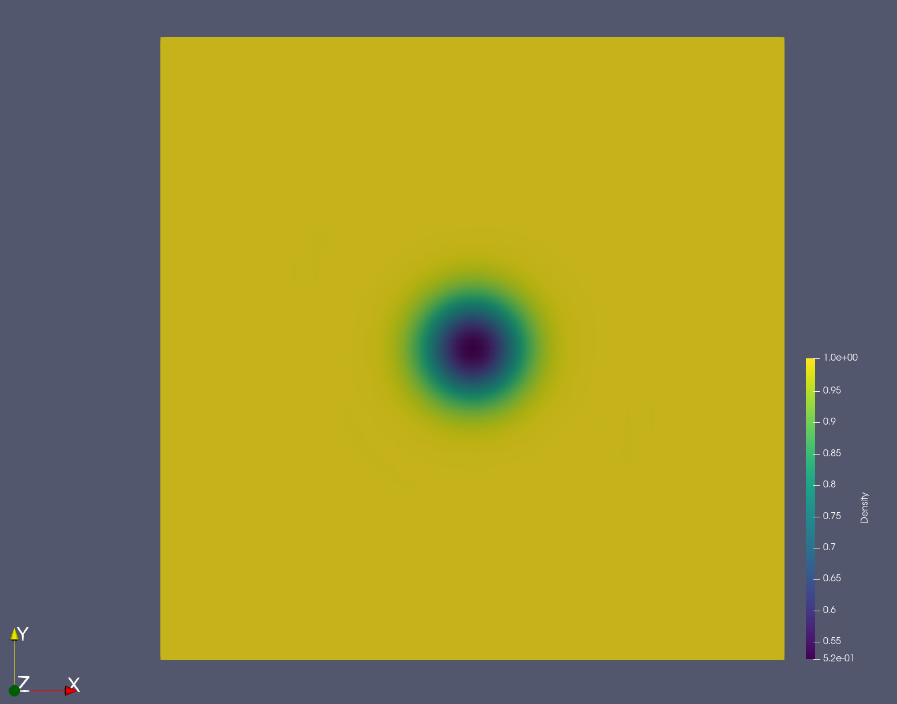
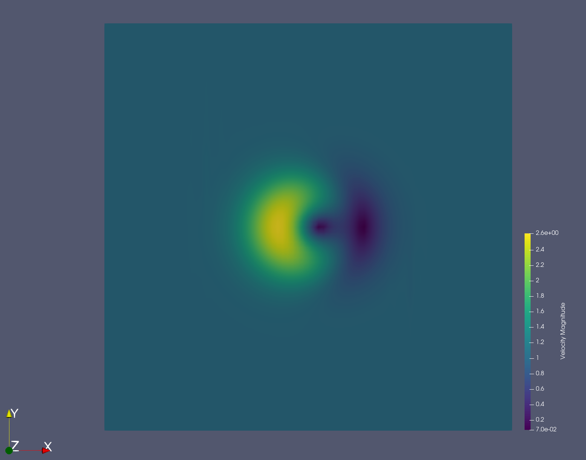

# 2D Euler vortex

Steps for running this example using the OpenMP backend are given below.

## Run with OpenMP

To run the simulation with the OpenMP backend, you must use the appropriate
settings for your system. This is accomplished by editing the
`[backend-openmp]` section in the `euler_vortex_2d.ini` configuration file.

For macOS:

```ini
[backend-openmp]
cc = gcc-8
cblas = /usr/lib/libblas.dylib
cblas-type = parallel
```

For Ubuntu:

```ini
[backend-openmp]
cc = gcc
cblas = /usr/lib/x86_64-linux-gnu/blas/libblas.so.3
cblas-type = parallel
```

Proceed with the following steps to run a parallel 2D Euler vortex simulation
on a structured mesh. These steps assume your current working directory is
this example's folder.

#### Step 1

Run pyfr to convert the Gmsh mesh file into a PyFR mesh file called
`euler_vortex_2d.pyfrm`.

```bash
$ pyfr import euler_vortex_2d.msh euler_vortex_2d.pyfrm
```

#### Step 2

Run pyfr to partition the PyFR mesh file into two pieces.

```bash
$ pyfr partition 2 euler_vortex_2d.pyfrm .
```

#### Step 3

Run pyfr to solve the Euler equations on the mesh, generating a series of PyFR
solution files called `euler_vortex_2d*.pyfrs`.

```bash
mpiexec -n 2 pyfr run -b openmp -p euler_vortex_2d.pyfrm euler_vortex_2d.ini
```

#### Step 4

Run pyfr on the solution file `euler_vortex_2d-100.0.pyfrs` converting it into
an unstructured VTK file called `euler_vortex_2d-100.0.vtu`. Note that in
order to visualise the high-order data, each high-order element is sub-divided
into smaller linear elements. The level of sub-division is controlled by the
integer at the end of the command.

```bash
$ pyfr export euler_vortex_2d.pyfrm euler_vortex_2d-100.0.pyfrs euler_vortex_2d-100.0.vtu -d 4
```

#### Step 5

Visualize the unstructured VTK file in Paraview.


*Color map of density distribution at 100 time units.*


*Color map of velocity magnitude at 100 time units.*
