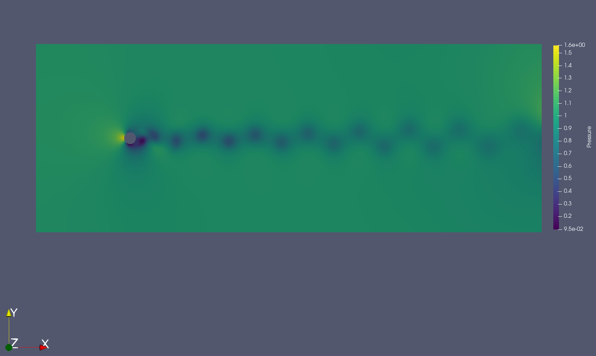
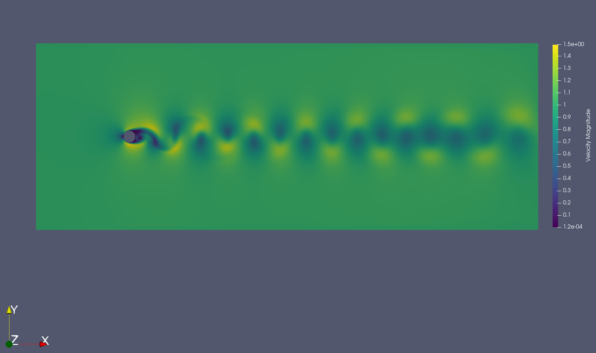

# 2D incompressible cylinder flow

Steps for running this example using the OpenMP backend are given below.

## Run with OpenMP

To run the simulation with the OpenMP backend, you must use the appropriate
settings for your system. This is accomplished by editing the
`[backend-openmp]` section in the `inc_cylinder_2d.ini` configuration file.

For macOS:

```ini
[backend-openmp]
cc = gcc-8
cblas = /usr/lib/libblas.dylib
cblas-type = parallel
```

For Ubuntu:

```ini
[backend-openmp]
cc = gcc
cblas = /usr/lib/x86_64-linux-gnu/blas/libblas.so.3
cblas-type = parallel
```

Proceed with the following steps to run a serial 2D incompressible cylinder
flow simulation on a mixed unstructured mesh. These steps assume your current
working directory is this example's folder.

#### Step 1

Unzip the compressed `inc_cylinder_2d.msh.gz` file. On macOS, you may need to
use `gzcat` to avoid errors. Then run pyfr to convert the Gmsh mesh file into
a PyFR mesh file called `inc_cylinder_2d.pyfrm`.

```bash
$ zcat inc_cylinder_2d.msh.gz | pyfr import -tgmsh - inc_cylinder_2d.pyfrm
```

#### Step 2

Run pyfr to solve the incompressible Navier-Stokes equations on the mesh,
generating a series of PyFR solution files called `inc_cylinder_2d-*.pyfrs`

```bash
$ pyfr run -b openmp -p inc_cylinder_2d.pyfrm inc_cylinder_2d.ini
```

#### Step 3

Run pyfr on the solution file `inc_cylinder_2d-75.00.pyfrs` converting it into
an unstructured VTK file called `inc_cylinder_2d-75.00.vtu`. Note that in
order to visualize the high-order data, each high-order element is sub-divided
into smaller linear elements. The level of sub-division is controlled by the
integer at the end of the command.

```bash
$ pyfr export inc_cylinder_2d.pyfrm inc_cylinder_2d_75.00.pyfrs inc_cylinder_2d_75.00.vtu -d 4
```

#### Step 4

Visualize the unstructured VTK file in Paraview.


*Color map of pressure magnitude distribution at 75 time units.*


*Color map of velocity magnitude distribution at 75 time units.*
